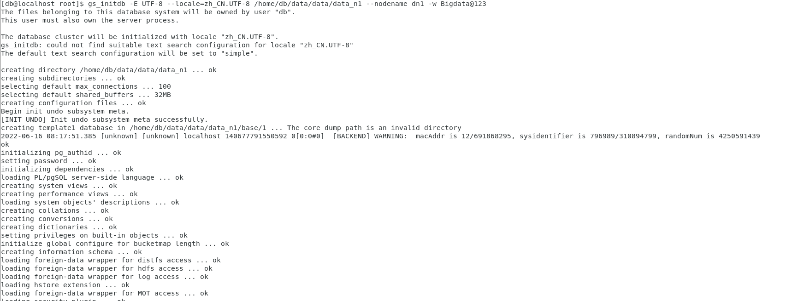

# openGauss 源码编译（v 3.0.0)

## 软硬件环境配置

## 硬件

CPU：2*2

内存：8GB

硬盘：70GB

## 软件

操作系统：centos 7.6

依赖文件安装：依赖文件的安装可以通过`sudo yum install libaio-devel flex bison ncurses-devel glibc-devel patch redhat-lsb-core readline-devel -y`


##  软件安装编译

* 下载软件包

  1. 下载openGauss-server

     > ```bash
     > git clone https://gitee.com/opengauss/openGauss-server.git openGauss-server -b branchname #openGauss的代码仓库 branchname ：代码分支名称，缺省可不填，如需编译openGauss 2.1.0的代码，可加上-b 2.1.0的参数。
     > ```

   2. 下载第三方软件包并解压

      > ```bash
      > wget https://opengauss.obs.cn-south-1.myhuaweicloud.com/3.0.0/openGauss-third_party_binarylibs.tar.gz #下载第三方软件仓库
      > 
      > tar -xzvf openGauss-third_party_binarylibs.tar.gz# 解压
      > 
      > mv openGauss-third_party_binarylibs binarylibs#重命名仓库
      > ```
      >
      > 

### 编译与安装

我编译的版本是debug版。

1. 进入`openGauss-server`文件夹。执行

   ```  bash
   sh build.sh -m debug -3rd 'pwd binarylibs 这里填的是第三方库解压路径' 

2. 执行成功

   > 

3. 设置系统变量

   ``` bash
   vi ~/.bashrc

> export CODE_BASE=/home/usrName/openGauss-server
> export BINARYLIBS=/home/userName/binarylibs
> export GAUSSHOME=/home/db/install/
> export GCC_PATH=$BINARYLIBS/buildtools/centos7.6_x86_64/gcc7.3/
> export CC=$GCC_PATH/gcc/bin/gcc
> export CXX=$GCC_PATH/gcc/bin/g++
> export LD_LIBRARY_PATH=$GAUSSHOME/lib:$GCC_PATH/gcc/lib64:$GCC_PATH/isl/lib:$GCC_PATH/mpc/lib/:$GCC_PATH/mpfr/lib/:$GCC_PATH/gmp/lib/:$LD_LIBRARY_PATH
> export PATH=$GAUSSHOME/bin:$GCC_PATH/gcc/bin:$PATH

```  bash
source ~/.bashrc 
```


## 初始化数据库

``` bash
gs_initdb -E UTF-8 --locale=zh_CN.UTF-8 /home/userName/data/data/data_n1 --nodename dn1 -w Bigdata@123 #-w 后面是设置数据库密码
```

> 

##  启动GaussDB 

这里启动GaussDB有两种方法

1.前台启动 

 `gs_initdb -E UTF-8 --locale=zh_CN.UTF-8 /home/userName/gaussdb-data/data/data_n1 --nodename dn1 -w Password`

2. 后台启动

`gs_ctl start -D /home/userName/install/data/datanode1 -Z single_node -l /home/userName/gauss.log`

*** 如果前台启动有问题可以试一试后台启动***

## 连接数据库

```bash
gsql -d postgres -p 5432 #p 5432是pg的默认端口
```


**可以看到连接成功**
